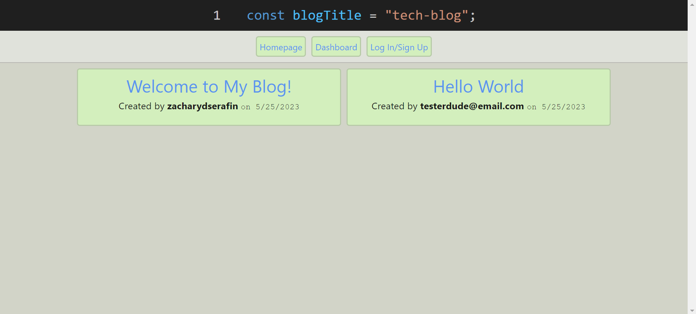

# Tech-Blog

## Table of Contents

1. [Description](#description)
2. [Usage Instructions](#usage)
3. [License](#license)
4. [Questions](#questions)

## Description 

This project is designed to imitate a blog-style forum, where users are able to sign up, log in, create posts, and comment on posts.

## Usage Instructions 

You can view posts via clicking on the title links on the homepage, but in order to create posts and comments you must sign up via the link in the navbar. Once signed in, you may comment on whatever posts you like, as well as create your own posts via the dashboard in the navbar. On the dashboard, you may edit or delete your posts by clicking on their individual titles.

## License 

No license provided.

## Questions 

Any questions or concerns regarding the project, you can contact me via my email: zserafin@hotmail.com

For more of my work, visit my GitHub: https://github.com/zacharydserafin